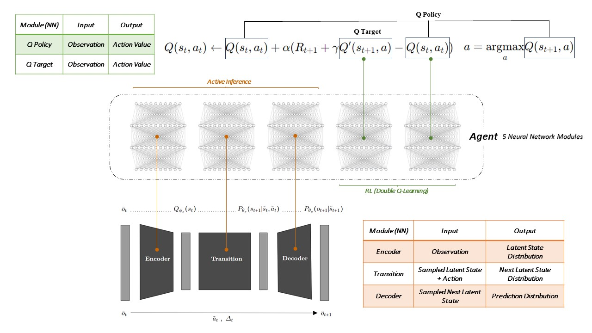

<h2 align="center"><a href="https://arxiv.org/abs/2406.09322">Active Inference Meeting Energy-Efficient Control <br> of Parallel and Identical Machines</a></h2>

<p align="center">
</p>

This project explores **deep active inference**, an emerging field that combines **deep learning** with the **active inference** decision-making framework. Leveraging a deep active inference agent, we focus on **controlling** **parallel and identical machine workstations** to **enhance energy efficiency**. We address challenges posed by the problem's stochastic nature and delayed policy response by introducing tailored enhancements.

- The project is based on a **[paper](https://arxiv.org/abs/2406.09322)** presented and accepted in the proceedings of the***10th International Conference on machine Learning, Optimization and Data science (LOD '24)***.

## Citation

Yeganeh, Y. T., Jafari, M., & Matta, A. (2024). Active Inference Meeting Energy-Efficient Control of Parallel and Identical Machines. arXiv preprint arXiv:2406.09322.

```
@article{yeganeh2024active,
  title={Active Inference Meeting Energy-Efficient Control of Parallel and Identical Machines},
  author={Yeganeh, Yavar Taheri and Jafari, Mohsen and Matta, Andrea},
  journal={arXiv preprint arXiv:2406.09322},
  year={2024}
}
```

## Contact

For inquiries or collaboration, please reach out to **yavar.taheri@polimi.it** or **yavar.yeganeh@gmail.com**.
