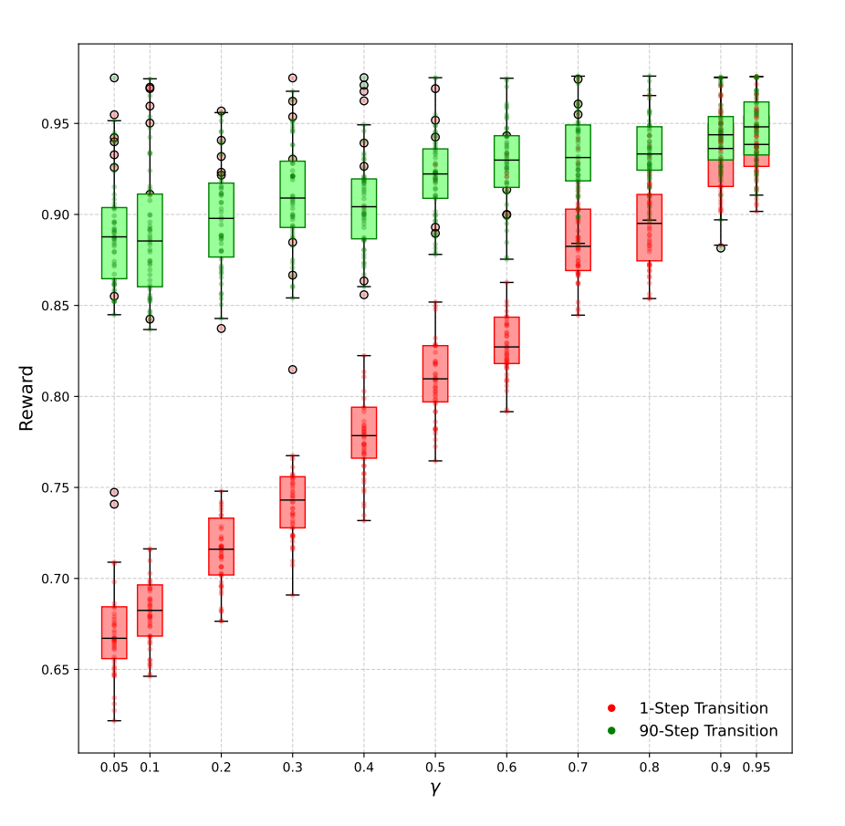

<h2 align="center"><a href="https://arxiv.org/abs/2406.09322">Active Inference Meeting Energy-Efficient Control <br> of Parallel and Identical Machines</a></h2>  
<p align="center">
    <a href="https://yavaryeganeh.github.io/">Yavar Taheri Yeganeh</a>
    ·
    <a href="https://ise.rutgers.edu/mohsen-jafari">Mohsen Jafari</a>
    ·
    <a href="https://www.mecc.polimi.it/en/research/faculty/prof-andrea-matta">Andrea Matta</a>


This project explores **deep active inference**, an emerging field that combines **deep learning** with the **active inference** decision-making framework. Leveraging a deep active inference agent, we focus on **controlling** **parallel and identical machine workstations** to **enhance energy efficiency**. We address challenges posed by the problem's stochastic nature and delayed policy response by introducing tailored enhancements.

- The project is based on a **[paper](https://arxiv.org/abs/2406.09322)** presented and accepted in the proceedings of the***10th International Conference on machine Learning, Optimization and Data science (LOD '24)***.

#### Key Contributions:

- **Deep Active-Inference-Based Agent:** With active inference integrating perception, learning, and action, the agent is tailored and enhanced for optimizing machine control in the stochastic manufacturing environment with delayed policy response.
- **Hybrid Horizon and Multi-Step Transition Methods:** These enhancements allow the agent to improve prediction and planning for longer horizons without computational burden.
- **Performance:** Experimental results show the effectiveness of enhancements compared to the existing agents as well as the potential of the proposed methodology. Notably, the agent achieved high rewards with simple one-step repeated multi-transition lookaheads.

<p align="center">
</p>

## Content

This repository contains the implementations of the project, including source code for the agent as well as the manufacturing environment simulator used for experiments.

## Requirements

You need a Python environment with the following libraries (and other supporting ones):

```
torch>=2.1.1
numpy>=1.24.3
simpy>=4.0.1
```

You can install them with pip by running:

```
pip install -r requirements.txt
```

Alternatively, you can use Conda with the YAML file provided in the repository:

```
conda env create -f tf-environment.yml
```

## Running

Clone the source code by running:

```
git clone https://github.com/YavarYeganeh/AIF_Meeting_EEC.git
cd ./AIF_Meeting_EEC
```

Then, train the agent by running:

```
python train.py --batch <batch_size> --gamma <gamma_value> --steps <number_of_steps> --samples <number_of_samples> --calc_mean

```

**Usage: train.py [-h]**

* **--batch** : Select batch size, i.e., the number of environments used for training.
* **--gamma** : Select gamma value (between 0 and 1) for balancing between short and long horizons during planning.
* **--steps** : Number of actions the transition considers (in multi-step transitions).
* **--samples** : Number of samples to be used for Expected Free Energy (EFE) calculations.
* **--calc_mean** : Whether to consider the mean during EFE calculations (flag to include the mean).

**Please note:** $\lambda_s$ can be directly set in `src/tfmodel.py`, and by default in this source code, $\lambda_s = 1.5$.

After training is finished, the code records data related to the performance and statistics of the agent from the experiment in the path `results/signature/stats_final.pkl`.

## Citation

Yeganeh, Y. T., Jafari, M., & Matta, A. (2024). Active Inference Meeting Energy-Efficient Control of Parallel and Identical Machines. arXiv preprint arXiv:2406.09322.

```
@article{yeganeh2024active,
  title={Active Inference Meeting Energy-Efficient Control of Parallel and Identical Machines},
  author={Yeganeh, Yavar Taheri and Jafari, Mohsen and Matta, Andrea},
  journal={arXiv preprint arXiv:2406.09322},
  year={2024}
}
```

## Contact

For inquiries or collaboration, please reach out to **yavar.taheri@polimi.it** or **yavar.yeganeh@gmail.com**.
